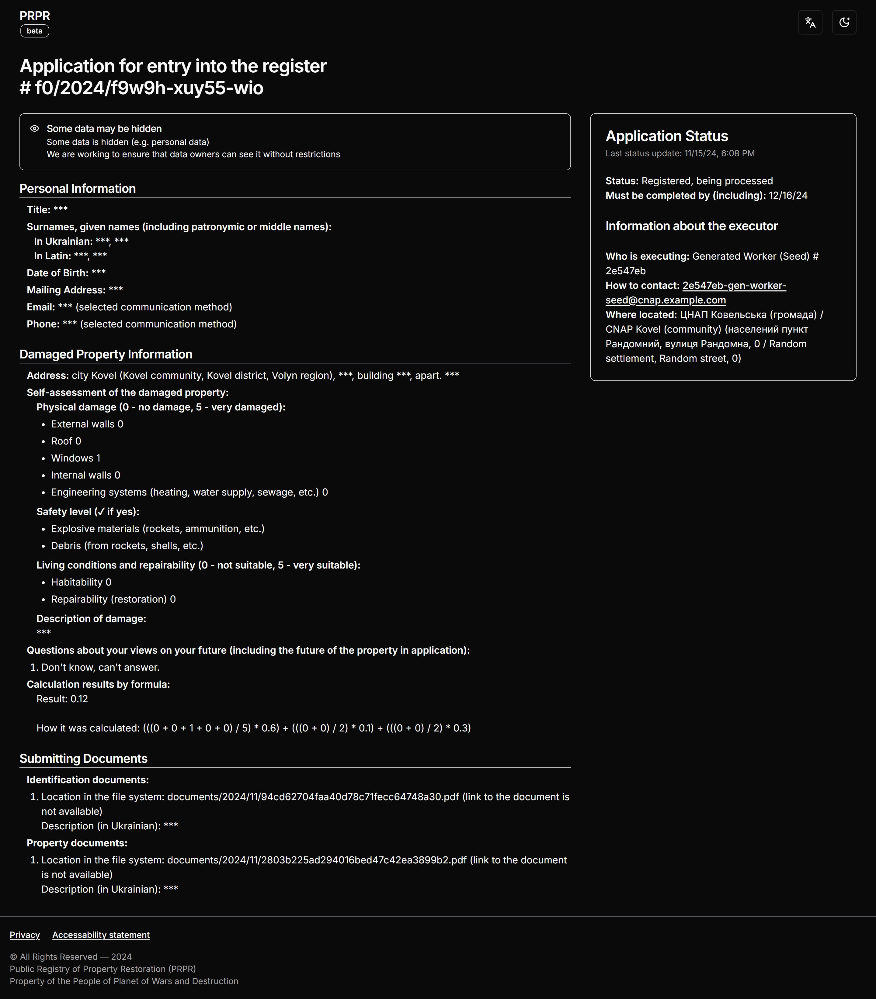
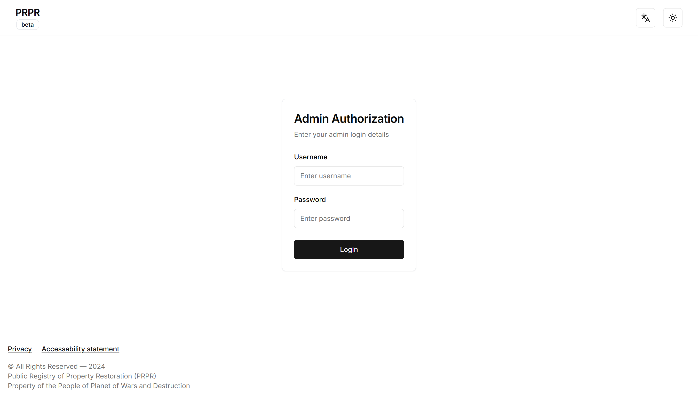
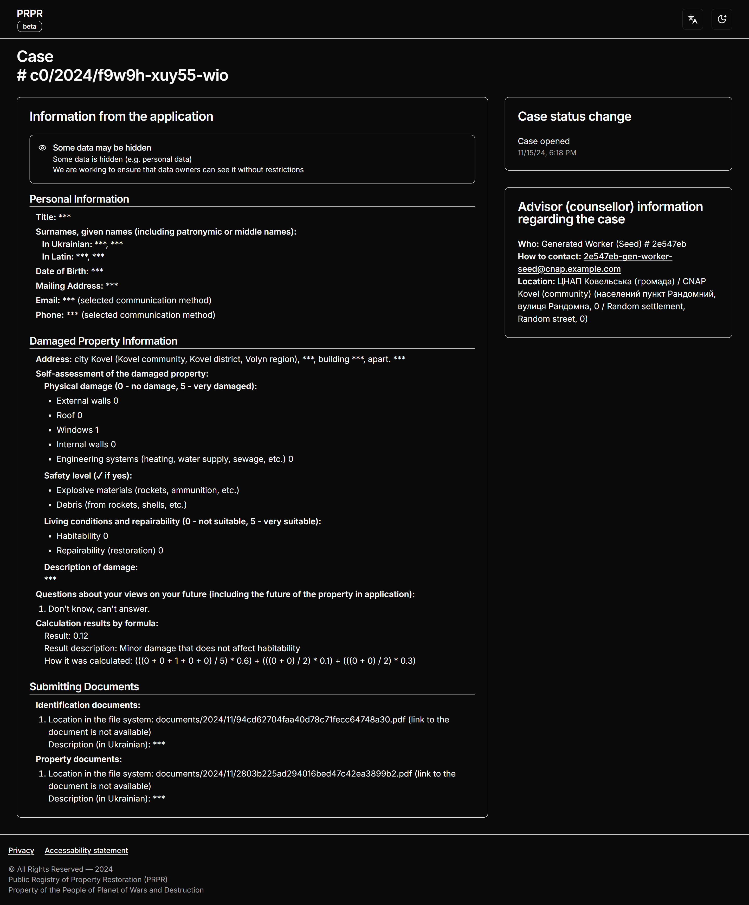

# PRPR (Public Registry of Property Restoration)

## About project

**PRPR is** a graduation project for the Information Systems and Technology master's degree at Kyiv Polytechnic Institute, Ukraine. The project was completed part-time (up to 20 hours per week for 2.5 months), with most of the effort dedicated to the astronomical amount of paperwork, as is required by the university. The project was developed by a single member.

**Why**: the project was developed to provide a transparent, efficient, and citizen-engaged system for documenting and managing information about destroyed property and infrastructure, facilitating effective post-war recovery efforts in Ukraine.

**Tech Stack**: TypeScript, Node.js (Nest.js), React (Next.js 13+), Postgres, Turborepo, S3 (AWS).

### What was done

**Functional features**: registration and submission of damage applications, real-time tracking of application and case status, admin features for review and approval of applications, integration with S3 storage for document uploads (automatic generation of signed URLs for secure file transfer) user-friendly interface for public and administrative use, etc.

## Screenshots

### Home (Index) Page

 Page")

### Application Creation Related Pages

")
")

### Application Page After Creating

### Admin Pages

### Application Page After Approve

### Case Page

## Diagrams

### Entity Relationship

### Architecture Diagram

### Sequence Diagram of Submitting Application f0

### Lifecycle Diagram of Application f0

### Sequence Diagram of Opening Case c0 as a Result of Application f0

